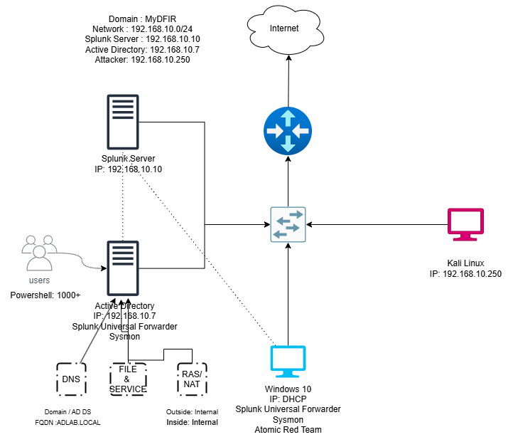

# 🧠 Active Directory Virtual Lab with Splunk & Kali Linux

## 📌 Project Overview
This project demonstrates how to set up a multi-VM enterprise-like environment using Oracle VirtualBox. The core of the lab is built around Active Directory, with additional components like a Splunk server for event logging and a Kali Linux machine for security testing. The lab is designed for learning, experimentation, and security monitoring in a controlled environment.
---
## 🎯 Objectives
- Simulate a real-world enterprise environment using virtual machines.
- Deploy and configure Active Directory services.
- Monitor network and host-based events using Splunk.
- Create and manage domain users at scale.
- Conduct basic penetration testing using Kali Linux.


## 🛠 Tools & Technologies
- Oracle VirtualBox  
- Windows Server 2019 (AD)  
- Windows 10 Pro (client)  
- Kali Linux (attacker)  
- Splunk Enterprise (on Ubuntu Pro)

## 🌐 Network Overview

- **Network Range:** `192.168.10.0/24`
- **Domain:** `adlab.local`

### 🧱 Lab Components

| Role              | OS              | IP Address        | Description |
|-------------------|------------------|--------------------|-------------|
| **Domain Controller** | Windows Server 2019 | `192.168.10.7`     | AD DS, DNS, Sysmon + Splunk UF |
| **Splunk Server**     | Ubuntu Server 20.04  | `192.168.10.10`    | Splunk Core for SIEM |
| **Windows 10 Client** | Windows 10 Pro       | DHCP (e.g. `.20`)  | Domain-joined, Sysmon + Splunk UF |
| **Kali Linux**        | Kali Rolling         | `192.168.10.250`   | Attacker machine (BloodHound, CME, Impacket) |
| **Router**            | pfSense/Generic      | `192.168.10.1`     | Internet gateway, DHCP |
| **Switch**            | Layer 2 switch       | N/A                | Connects all devices |
---

## 🗺️ Lab Diagram



### 🖥️ Hardware Requirements
- **RAM:** 16 GB (allocated across all VMs)  
- **Disk Space:** 250 GB (not fully utilized but reserved for scalability and VM snapshots)  
- **CPU:** Quad-Core or better recommended  
- **Host OS:** Windows/Linux/macOS with VirtualBox installed

### 🔧 Virtual Machines Setup
- **Windows Server 2019**: Active Directory Domain Controller  
- **Windows 10 Pro**: Target machine to join the domain  
- **Kali Linux**: Used for simulating attacks  
- **Splunk (Ubuntu Pro)**: Centralized event monitoring and logging  

## ⚙️ Installation & Configuration

### ✅ Virtual Machine Creation
All virtual machines were created using Oracle VirtualBox.  
**Tip:** Always verify the integrity of downloaded installation files using checksum hashes.

Example command (PowerShell on Windows):
`Get-FileHash .\Downloads\filename.iso`  
Compare the output with the official hash provided on the download website.

📸 *Screenshot: Bulk User Creation in AD*


### 💡 Network Configuration
Static IP configuration was applied to the Ubuntu-based Splunk server using Netplan.  
👉 See detailed config: [`network-config.yaml`](/configs/network-config.yaml)

---

## 🏗️ Active Directory Deployment

### 🖥️ Domain Controller Setup (adlab.local)
- Installed Windows Server 2019.
- Promoted the server to a domain controller.
- Configured services:
  - **Active Directory Domain Services**
  - **DNS**
  - **RAS/NAT**

📸 *Screenshot: AD Domain Confirmation*


📸 *Screenshot: AD Services Configuration*  


### 🧑‍💼 Bulk User Creation
Used a PowerShell script to generate over **1000 user accounts** under _USERS in Active Directory.  
👉 Script source: [`powershell-script.ps1`](/scripts/powershell-script.ps1)

📸 *Screenshot: Bulk User Creation in AD*


## 🧩 Client Configuration

The Windows 10 Pro client machine was:
- Assigned a static IP address and DNS pointing to the domain controller
- Joined to the domain via system settings

📸 *Screenshot: Domain Join Confirmation*  


## 📊 Splunk Server & Logging

- Splunk Enterprise was installed on Ubuntu Pro for centralized log collection.
- Forwarded logs from Windows Server using Splunk Universal Forwarder.
- Monitored Active Directory-related events and suspicious activity in real time.

👉 Full setup details: [`splunk-setup.md`](#)

📸 *Screenshot: Splunk Dashboard with Windows Events*  


## 🧪 Security Simulation (Kali Linux)

Kali Linux was used to simulate attack scenarios:
- Network scans (e.g., Nmap)
- Authentication probing
- Lateral movement within the domain

Logs and behaviors were monitored in Splunk to assess detection capability.

## 🛠️ Troubleshooting
Common issues encountered during setup and how to resolve them.

---

### 📺 Virtual Machine Not Entering Fullscreen

**Issue**:  
The VM display doesn't adapt to full screen, limiting usability.

**Cause**:  
Missing VirtualBox Guest Additions, which enable better integration between host and guest OS.

**Solution**:
1. Start the virtual machine.
2. Go to the menu bar in VirtualBox:  
   `Devices > Insert Guest Additions CD Image...`
3. Run the setup inside the guest OS.
4. Reboot the VM after installation.

### 🖥️ Ubuntu Server GUI Not Displayed After Login

**Issue**:  
After installing a desktop environment on Ubuntu Server, the system still boots into a terminal (CLI) instead of a graphical interface (GUI).

**Cause**:  
The system is defaulting to multi-user (non-GUI) target or the GUI was not properly installed.

**Solution**:
1. Ensure the desktop environment is installed:
   ```bash
   sudo apt update
   sudo apt install ubuntu-desktop
   sudo systemctl set-default graphical.target
   sudo reboot

---

## 🧠 Key Learnings

- Created a self-contained enterprise network lab using virtual machines.
- Gained real-world experience configuring Active Directory, DNS, DHCP, and NAT.
- Collected and analyzed log data using Splunk.
- Simulated cyber-attacks and interpreted event responses.
- Navigated and resolved typical IT infrastructure issues.
